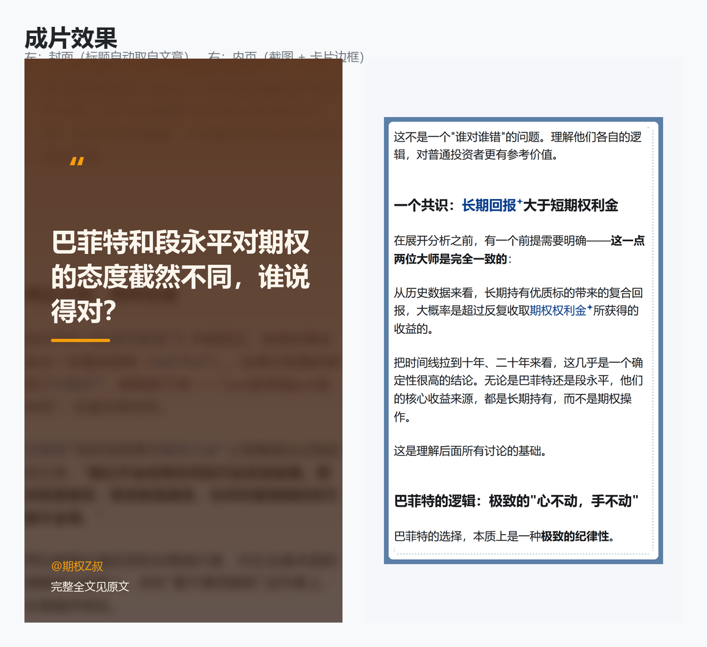
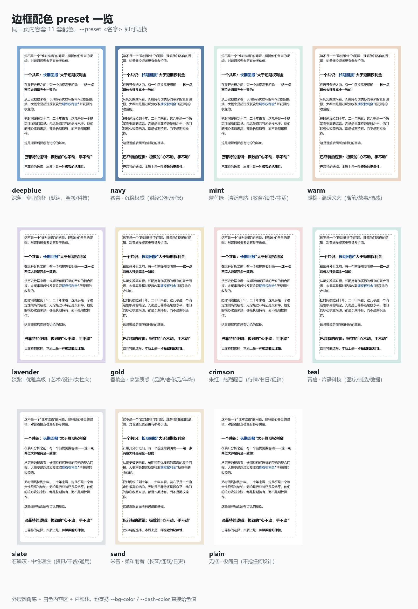
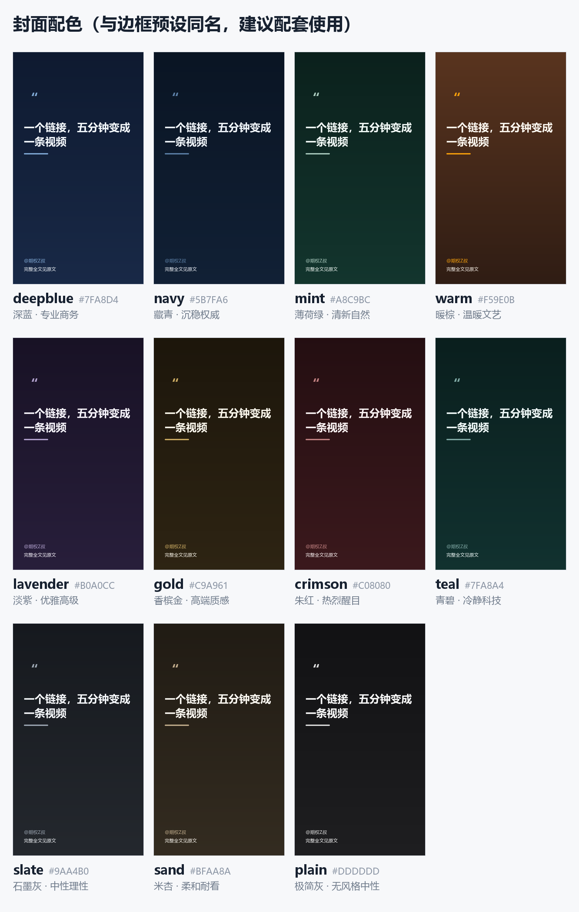

# link-to-video

给一个文章链接，输出一条可以直接发的视频号竖版短视频。

知乎专栏 / 回答、微信公众号文章 → 手机视口截图 → 按段落切成若干页 → 卡片式边框 → 封面 + BGM → **1080×1920 MP4**。
同时产出一套干净截图，可直接发小红书。

```
https://mp.weixin.qq.com/s/xxx   ──►   final.mp4 (27s, 1080×1920)
                                  └─►   screenshots/slide_1..7.png
```

---

## 效果预览

### 成片长什么样

<p>
  
</p>

左为封面（标题自动取自文章原标题，支持 24 字自动折行），右为内页（文章截图 + 卡片边框）。

### 11 种边框配色

同一页内容套 11 套配色，一条 `--preset` 参数切换：

<p>
  
</p>

| 预设名 | 外层 | 虚线 | 适用 |
|---|---|---|---|
| `deepblue` | `#7FA8D4` | `#5A82B0` | 深蓝 · 专业商务（默认，金融/科技） |
| `navy` | `#5B7FA6` | `#3E5C7E` | 藏青 · 沉稳权威（财经分析/研报） |
| `mint` | `#D8EDE5` | `#A8C9BC` | 薄荷绿 · 清新自然（教育/读书/生活） |
| `warm` | `#E8D5C4` | `#C4A484` | 暖棕 · 温暖文艺（随笔/故事/情感） |
| `lavender` | `#DDD6EB` | `#B0A0CC` | 淡紫 · 优雅高级（艺术/设计/女性向） |
| `gold` | `#F0E4C8` | `#C9A961` | 香槟金 · 高端质感（品牌/奢侈品/年终） |
| `crimson` | `#F2DADA` | `#C08080` | 朱红 · 热烈醒目（行情/节日/促销） |
| `teal` | `#D2E8E6` | `#7FA8A4` | 青碧 · 冷静科技（医疗/制造/数据） |
| `slate` | `#DDE1E6` | `#9AA4B0` | 石墨灰 · 中性理性（资讯/干货/通用） |
| `sand` | `#EDE4D3` | `#BFAA8A` | 米杏 · 柔和耐看（长文/连载/日更） |
| `plain` | `#FFFFFF` | `#DDDDDD` | 无框 · 极简白 |

也可以只改一层：`--preset navy --dash-color '#2E4A6B'`，或直接给两个十六进制色值。

### 11 种封面配色

封面配色**与边框预设同名同色相** —— 选 `--preset navy` 边框，就配 `--theme navy` 封面，
封面的引号、accent 短线、`@署名` 直接取该边框的外层色，整条视频一套视觉。

<p>
  
</p>

```bash
# 看全部配色
python scripts/make_final.py --workdir . --out x.mp4 --list-themes

# 重新生成上面这张对比图
python scripts/make_cover_preview.py

# 同一篇一次出多个配色封面挑色
for t in deepblue navy mint sand; do
  python scripts/make_final.py --workdir $WORK --slices-dir capture_v2 \
      --out $WORK/final.mp4 --cover-only --theme $t --cover-out "$WORK/cover_$t.png"
done
```

封面背景没有直接用强调色 —— 边框色是给白底卡片用的浅色，拿来当封面底压不住 88px 大字。
每套 theme 另有按该色相调深的渐变；传了背景图（首张切片）时会叠高斯模糊 + 压暗。

只想换强调色、保留背景渐变：`--theme navy --cover-accent '#F59E0B'`。

---

## 快速开始

```bash
PY=C:/Users/Lenovo/.workbuddy/binaries/python/envs/default/Scripts/python.exe
SKILL=C:/Users/Lenovo/.workbuddy/skills/link-to-video
WORK=C:/Users/Lenovo/WorkBuddy/<日期>/<文章slug>

# 1 截图（最慢，只跑一次）
$PY $SKILL/scripts/capture.py "<文章URL>" --out $WORK/capture_v1 --slices 7

# 2 按视觉跨度重新切片（capture 的等高分法遇空白会失衡）
$PY $SKILL/scripts/reslice.py --base $WORK --input-dir capture_v1 --out-dir capture_v2 --slices 7

# 3 裁掉空白与 UI 垃圾 → screenshots/（先给用户看这步的产物）
$PY $SKILL/scripts/clean_slices.py --base $WORK --input-dir capture_v2

# 4 卡片边框（配色由用户选）
$PY $SKILL/scripts/add_border.py --workdir $WORK --preset navy

# 5 合成（封面标题自动读 meta.json；--theme 用和第 4 步 --preset 相同的名字）
cp $WORK/capture_v1/meta.json $WORK/capture_v2/meta.json
$PY $SKILL/scripts/make_final.py --workdir $WORK --slices-dir capture_v2 \
    --out $WORK/final.mp4 --theme navy --bgm focus
```

`--bgm` 支持 `random` / 情绪包名(`upbeat` `calm` `focus` `warm`) / 文件路径 / `none`。

---

## 这个技能解决了什么

做这类视频的坑基本都在"自动化之后才发现"的地方，下面四条都已内置修复。

**1. 加粗消失**
知乎移动端把 `<b>/<strong>` 设成 `font-weight:500`。Windows 没有苹方，回退到微软雅黑后只有 400/700 两个字重，CSS 规范下 500 就近回退到 400 —— 加粗彻底没了（Mac 上正常，所以很容易漏检）。
已内置：把 500~699 字重强制提升到 700。实测墨量 +13.8%。

**2. 最后一行被切掉**
早先按「整行非背景像素占比 > 5%」判定内容行，换行后只剩几个字的短行（占行宽约 15%）会被当成空白裁掉。
已改为逐行墨量统计 + 连续空白行分块 + 孤立小图标剔除。

**3. 配图不显示**
微信/知乎把图片地址放在 `data-src` 上靠滚动触发，失败时渲染成整宽、几百 px 高、灰度恒定的浅灰占位块 —— 肉眼看就是一片空白，很难定位。
已内置：强制写回 `src` 并等所有图片 `complete && naturalWidth>0`，超时会告警。

**4. 页面长短悬殊**
按页面高度均分切片，遇到大片空白就会失衡（实测某篇最矮 755px、最高 2133px，3 倍差距）。
`reslice.py` 改为把超长空白段在度量上压缩后再等分，切口吸附到最近空白段中心。同一篇收敛到 1743~2200（1.26 倍）。

---

## BGM 曲库

内置 22 首（Kevin MacLeod / incompetech.com，**CC-BY 4.0**），已裁成 90 秒 1.4MB 片段，按情绪分包：

| 目录 | 首数 | 适用 |
|---|---|---|
| `upbeat/` | 8 | 教程、干货、开场抓人 |
| `calm/` | 5 | 深度分析、读书、长文解读 |
| `focus/` | 5 | 数据、科技、品牌、企业向 |
| `warm/` | 4 | 故事、人物、情感、收尾 |

选曲后脚本会打印署名文本，**发布时贴进视频简介**（CC-BY 要求）：

```
Music: "Tech Live" Kevin MacLeod (incompetech.com)
Licensed under Creative Commons: By Attribution 4.0
```

扩充曲库：

```bash
$PY $SKILL/scripts/fetch_bgm.py --search "piano"     # 线上 1400+ 首里搜
$PY $SKILL/scripts/fetch_bgm.py --fetch "曲名" --mood upbeat
$PY $SKILL/scripts/fetch_bgm.py --list
```

---

## 目录结构

```
link-to-video/
├── SKILL.md                  技能工作流（AI 读这个）
├── README.md                 本文件
├── scripts/
│   ├── capture.py            手机视口截图 + 按段落边界切片
│   ├── reslice.py            按视觉跨度重新切片
│   ├── clean_slices.py       智能裁剪空白/UI/孤立图标
│   ├── add_border.py         卡片式边框（11 种配色预设）
│   ├── make_final.py         封面生成（11 种配色）+ ffmpeg 合成
│   ├── make_cover_preview.py 生成 11 种封面配色对比图
│   ├── fetch_bgm.py          BGM 曲库管理
│   ├── make_preview.py       生成本文件用的预览图
│   └── make_video.py         旧版一步式合成
└── assets/
    ├── bgm/                  22 首 CC-BY 音乐 + manifest.json
    ├── examples/             预览图（presets.png / sample_*.png）
    └── storage_state.json    知乎登录态
```

## 环境要求

- Python 3.13（`playwright` / `imageio-ffmpeg` / `pillow` / `numpy`）
- 本机 Chrome（playwright `channel="chrome"`）
- 知乎需要登录态：首次跑 `capture.py login --out <dir> --login` 扫码保存

## 许可

- 代码：随仓库许可
- BGM：CC-BY 4.0，可商用，需署名（见上）
- 建议只用于自己有版权的文章
